<h1>Aplikacja do monitorowania jednostek morskich</h1>
<h2>Kamil Wójcik</h2>
<h2>Pomysł</h2>
  
    Aplikacja pozwala na monitorowanie położenia statków w okół wybrzerza norwegii (na podstawie danych udostępnionych przez API BarentsWatch). Użytkownik aplikacji ma również możliwość rejestracji oraz logowania dzięki czemu uzyskuje możliwość do włączenia śledzenia wybranych przez niego statków.
  

  <h3>Poniżej znajdują się prezentacja aplikacji w formie filmu oraz zdjęć 
  z opisem</h3>
  <h3>Prezentacja w formie filmiku:</h3>
  
  
  <h3>Prezentacja w formie zdjęć z opisem</h3>
  <h4>Moduł monitorowania pozycji statków</h4>

  

  

  

  <h4>Logowanie i rejestracja do modułu śledzenia wybranych jednostek</h4>

  

  

    
  

  

    
  

  <h4>Dodanie statków do śledzenia</h4>

  

  
  
  

  <h4>Obserwacja wyników śledzenia</h4>

  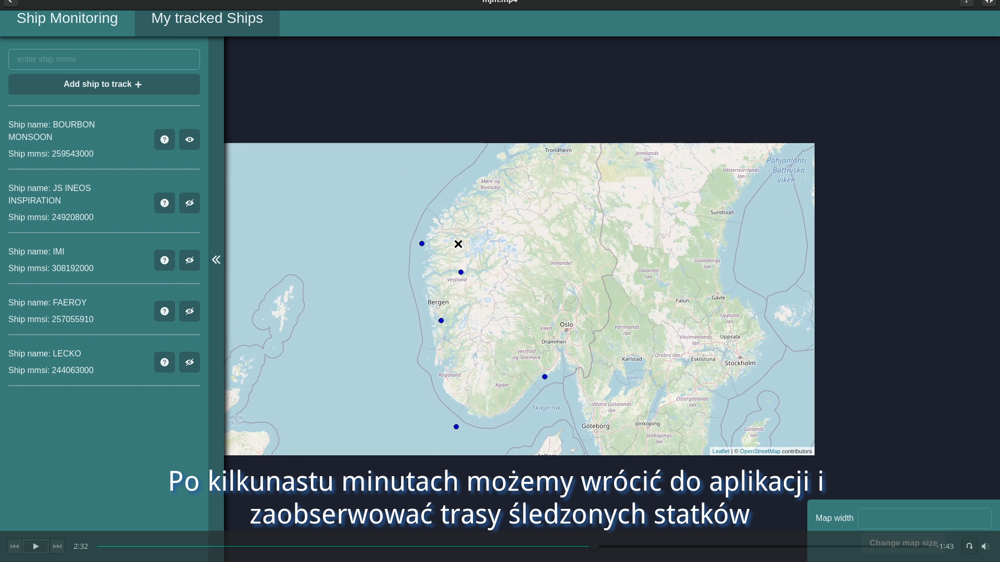
  <h5>Za statkiem pojawił się "ogonek" jest to trasa jaką do tej pory pokonał</h5>

  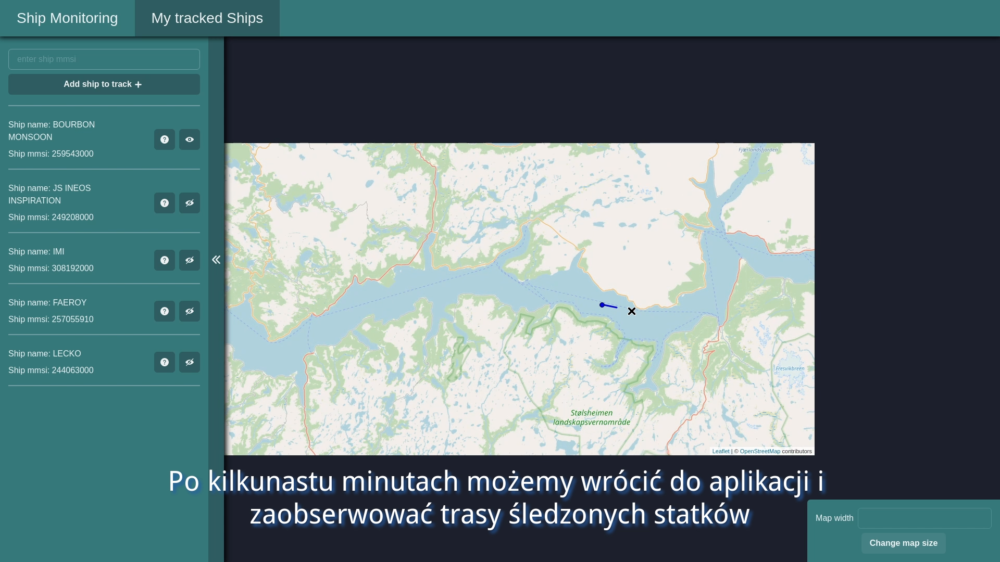

  <h5>Stan aplikacji po godzinie</h5>

  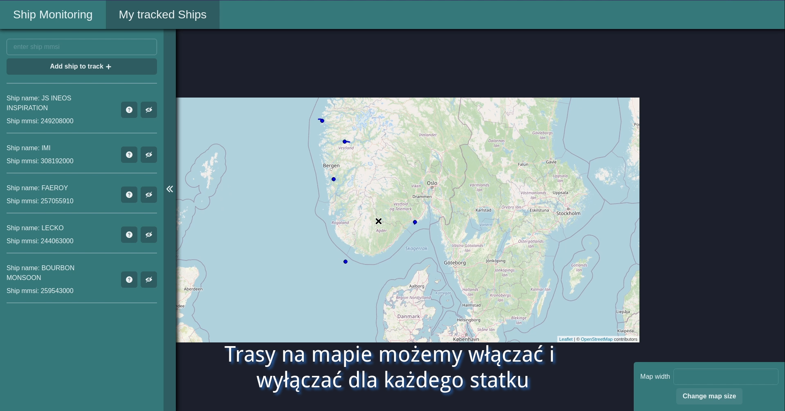

  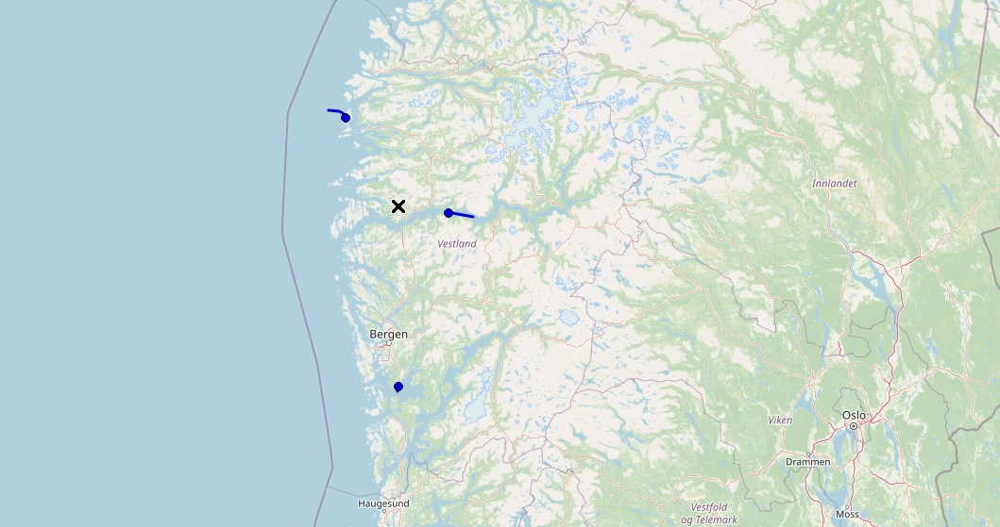

  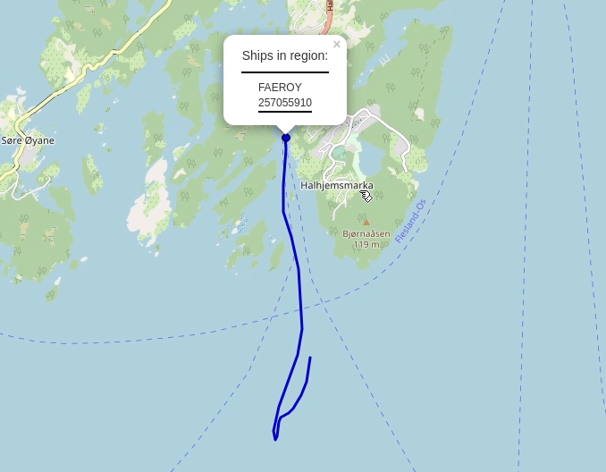

  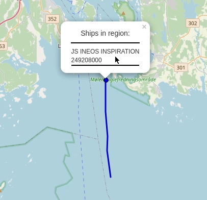

  <h5>Oraz po około 4 godzinach</h5>

  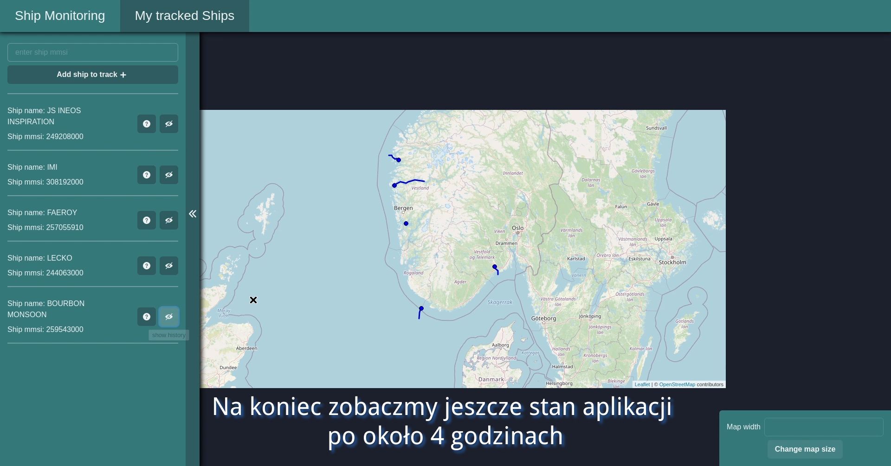

  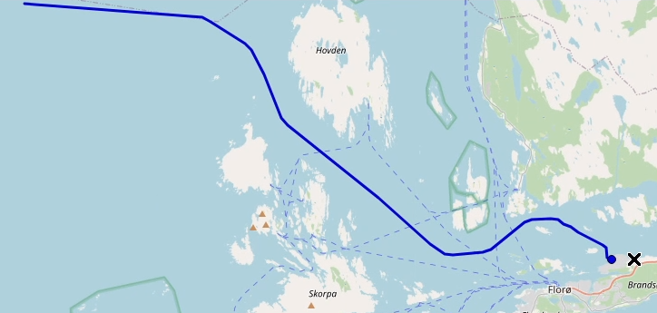

  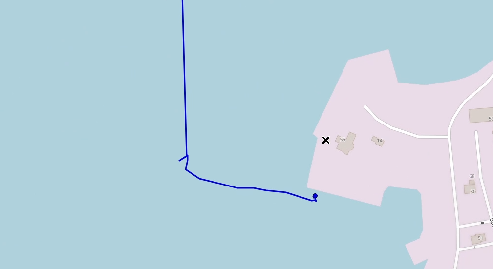

  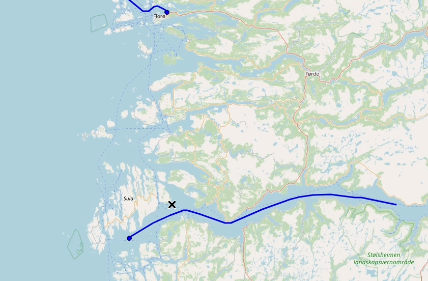

  
  
  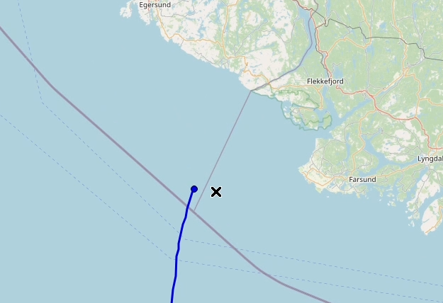

  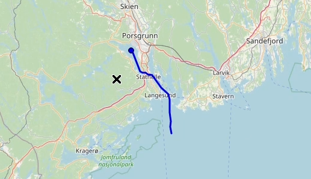

  <h4>Aplikacja umożliwia dodatkowo:</h4>
  <h5>Wyświetlenie lokalizacji danego statku w formie listy</h5>

  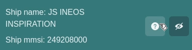

  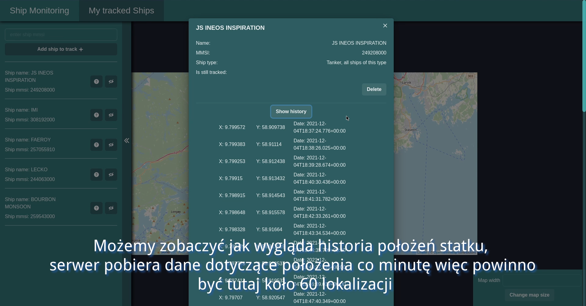

  <h5>Usuniecie danego statku z listy śledzonych jednostek</h5>

  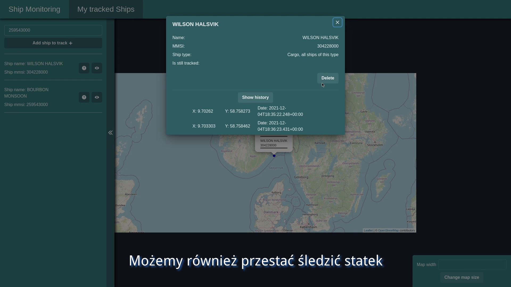

  <h5>Oraz włączanie/wyłączanie wyświetlania trasy danego statku</h5>

  

  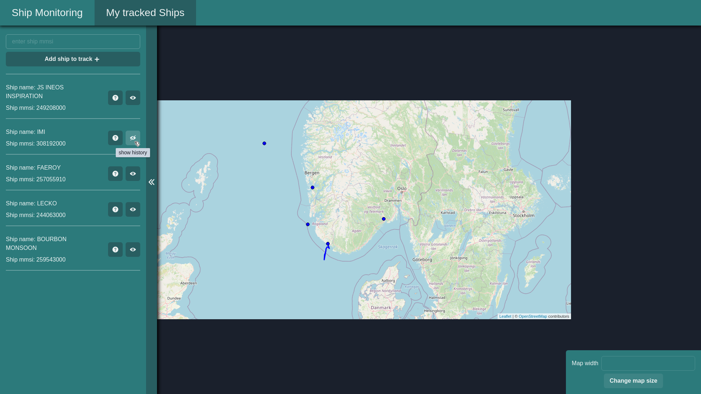

<h2>Jak zainstalować</h2>
  <h3>Uwagi</h3>
    <ul>
      <li>Aplikacja została wykonana w opraciu o poniższe api 
         https://www.barentswatch.no/en/about/open-data-via-barentswatch/
         https://www.barentswatch.no/minside/
      </li>
      <li>
        Aby zalogować się do powyższego api potrzebne są client oraz secret które w poniższych instrukcjach uruchomienia aplikacji nalezy podać
        zamist następujących tagów: &lt;secret>, &lt;client>
      </li>
      <li>
        W filmikach pokazujących uruchamianie aplikacji oraz zgłoszeniu zostały podane przykładowe dane
        logowania do api które moga być wykorzstane do przetestowania aplikacji
      </li>
    </ul>
  <h3>Sposób 1 (dla systemów z obługą bash'a)</h3>
  <h4>Wymagania</h4>
  <ul>
    <li>zainstalowany i uruchomiony doker</li>
    <li>system obługujący bash</li>
  </ul>
  <h4>Filmik pokazujący poniższe instrukcje: https://youtu.be/luM0zmKOpQ4</h4>
  
   
  <h4>Instrukcja</h4>
  
    #Kopjujemy niniejsze repozytorim do dowolnego folderu
    git clone https://github.com/Harry29-exe/Monitorowanie-jednostek-morskich

    #Wchodzimy do folderu ze skryptem uruchamiającym 
    cd Monitorowanie-jednostek-morskich/backend

    #uruchamiamy skrypt (przywileje administratora potrzebne są do uruchomienia kontenerów docker)

    sudo bash ./build-start.sh <secret> <client>
  
  <h4></h4>
  
  <h3>Sposób 2 (dla pozostalych)</h3>
  <h4>Wymagania</h4>
  <ul>
    <li>zainstalowany i uruchomiony doker</li>
  </ul>
  <h4>Filmik pokazujący poniższe instrukcje: https://youtu.be/luM0zmKOpQ4</h4>
  
   
  <h4>Instrukcja</h4>
  

    #Kopjujemy niniejsze repozytorim do dowolnego folderu
    git clone https://github.com/Harry29-exe/Monitorowanie-jednostek-morskich
  
    #Wchodzimy do folderu z backendem aplikcji 
    cd Monitorowanie-jednostek-morskich/backend/postgres
    #budujemy oraz uruchamiamy bazę danych
    sudo docker build ./postgres --tag mjm-db;
    sudo docker run -p 5432:5432 -d --name mjm-db mjm-db;
    
    #budujemy oraz uruchamiamy aplikację
      sudo docker build ./ --tag mjm;
    sudo docker run -p 8080:8080 -e secret=<secret> -e clientId=<client> --net=host --name mjm mjm

  
  
  
